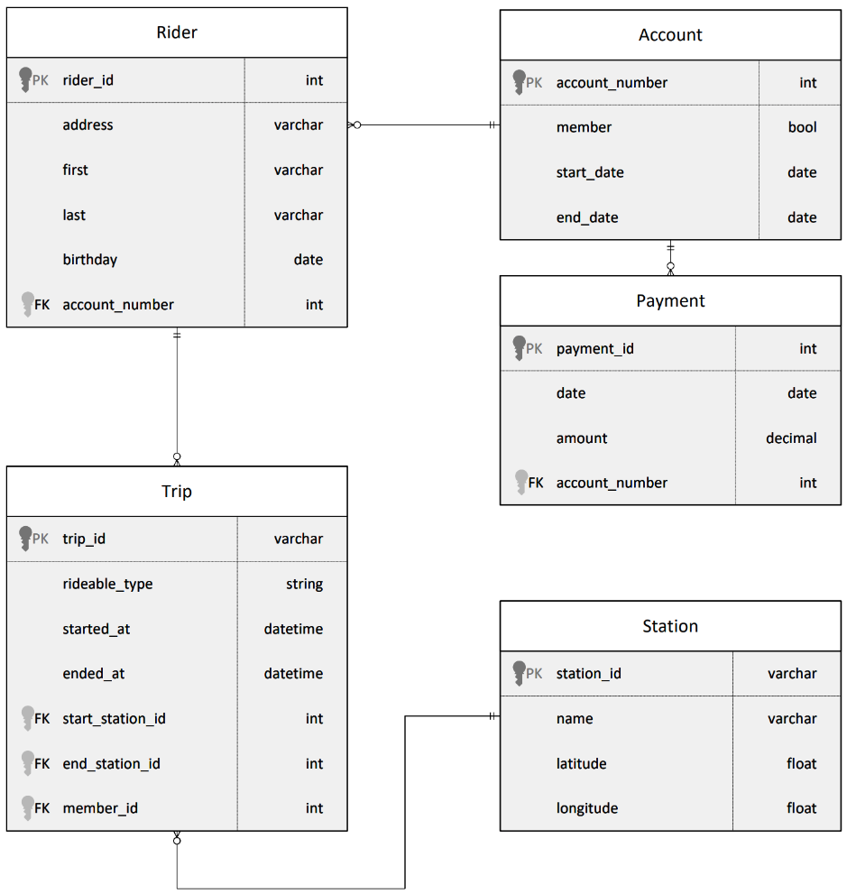
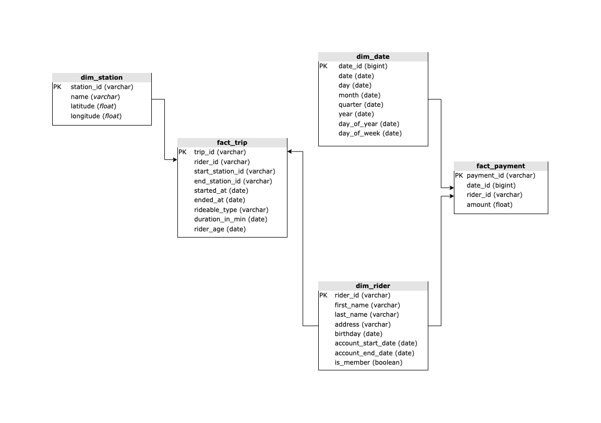
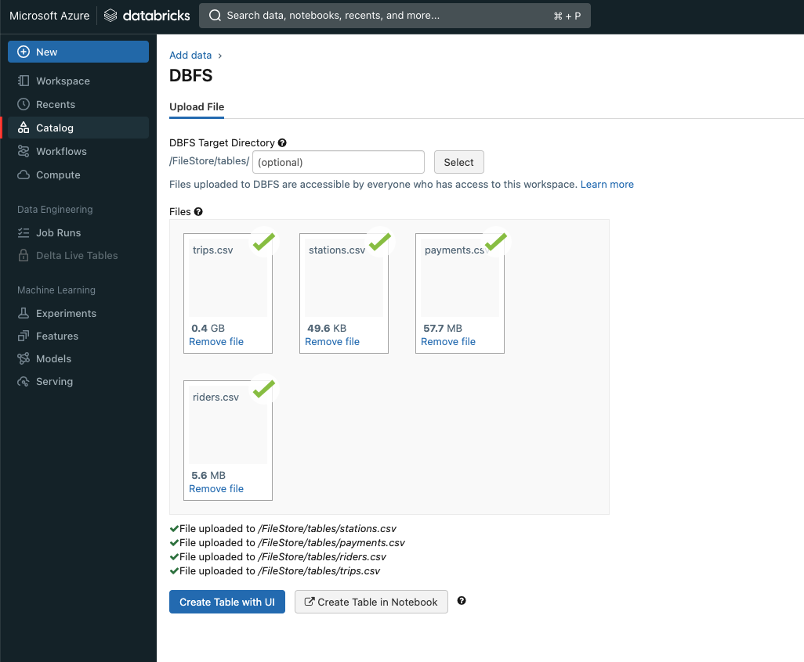

# Azure-Data-Lakehouse-Project
Divvy is a bike sharing program in Chicago, Illinois USA that allows riders to purchase a pass at a kiosk or use a mobile application to unlock a bike at stations around the city and use the bike for a specified amount of time. The bikes can be returned to the same station or to another station. The City of Chicago makes the anonymized bike trip data publicly available for projects like this where we can analyze the data.

Since the data from Divvy are anonymous, we have created fake rider and account profiles along with fake payment data to go along with the data from Divvy. The dataset looks like this:

The goal of this project is to develop a data lake solution using Azure Databricks using a lake house architecture. You will:
- Design a star schema based on the business outcomes listed below;
- Import the data into Azure Databricks using Delta Lake to create a Bronze data store;
- Create a gold data store in Delta Lake tables;
- Transform the data into the star schema for a Gold data store;

### The business outcomes it is designed for are as follows:
1. Analyze how much time is spent per ride
   - Based on date and time factors such as day of week and time of day
   - Based on which station is the starting and / or ending station
   - Based on age of the rider at time of the ride
   - Based on whether the rider is a member or a casual rider
2. Analyze how much money is spent
   - Per month, quarter, year
   - Per member, based on the age of the rider at account start

## Project Steps

### Step 1: Design the Star Schema

### Step 2:  Import the data into Azure Databricks using Delta Lake to create a Bronze data store
1. Import the .csv files to DBFS

    

2. Execute the code in [extract_from_DBFS.ipynb](extract_from_DBFS.ipynb)
3. Execute the code in [load_to_staging.ipynb](load_to_staging.ipynb)

### Step 3:  Transform the data into the star schema for a Gold data store